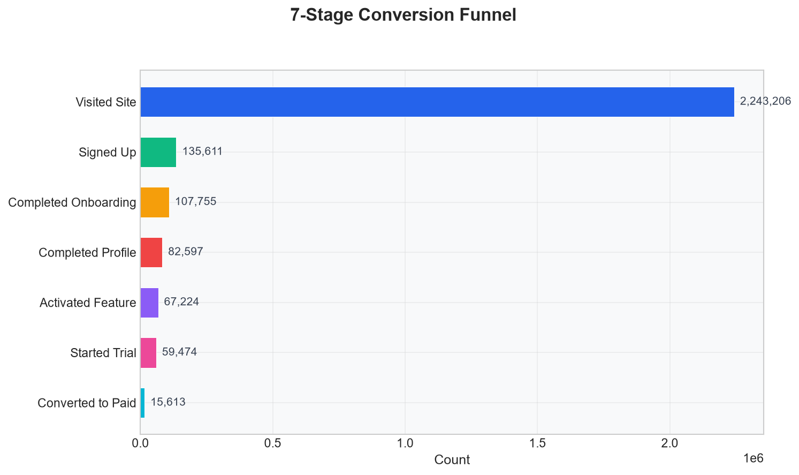

# E-Commerce Conversion Funnel Analysis

Built an end-to-end analytics pipeline that transforms 2.24M visitor records into a 7-stage conversion funnel, uncovering a 0.7% visitor-to-paid conversion rate across signups, trials, and paid adoption.

## What I Did

- Transformed 2.24M visitor records using SQL to build a funnel spanning visitor acquisition → signup → onboarding → profile completion → feature activation → trial → paid conversion
- Built a star-schema Power BI dashboard with DAX measures tracking signup (6.05%), trial (43.86%), and paid conversion (26.25%) stages
- Created a Python data generator (`data/generate_data.py`) that produces realistic daily-channel aggregated data and an optional granular file with 2.24M individual visitor records
- Documented metric definitions and SOPs to translate funnel findings into optimization recommendations

## Key Findings

| Stage | Rate |
|-------|------|
| Visitor → Signup | 6.05% |
| Signup → Trial | 43.86% |
| Trial → Paid | 26.25% |
| **Visitor → Paid** | **0.70%** |

## Data

The raw data lives in `data/raw/`. The main file (`visitors.csv`) has ~5,848 rows — each row is one day × one channel, with a `visitors` count column. The sum of that column is 2,243,206 total visitors.

If you want individual visitor records, `visitors_granular.csv` has 2.24M rows with visitor_id, date, channel, device, country, and session duration.

```bash
# Check aggregated data
python -c "import pandas as pd; df=pd.read_csv('data/raw/visitors.csv'); print(f'Rows: {len(df):,}'); print(f'Total visitors: {df.visitors.sum():,}')"

# Check granular data
python -c "import pandas as pd; df=pd.read_csv('data/raw/visitors_granular.csv'); print(f'Rows: {len(df):,}'); print(f'Unique visitors: {df.visitor_id.nunique():,}')"
```

## How to Regenerate

```bash
pip install pandas numpy
python data/generate_data.py        # produces aggregated CSVs
python data/generate_granular_visitors.py  # produces 2.24M-row granular file
```

## Dashboard

The Power BI dashboard (`powerbi/growth_funnel_dashboard.pbix`) visualizes funnel performance, conversion rates by channel and device, monthly trends, and revenue opportunity analysis. DAX measures are in `powerbi/dax/`.



## Project Structure

```
├── data/
│   ├── raw/              # Generated CSVs (visitors, signups, trials, etc.)
│   ├── curated/          # Aggregated metrics by channel, cohort
│   └── warehouse/        # Target calendars, growth goals
├── sql/                  # DDL, staging, marts, metrics, monitoring, reporting
├── python/               # ETL, validation, monitoring, reporting scripts
├── powerbi/              # DAX measures, semantic model, Power Query scripts
├── assets/               # Dashboard screenshots
├── outputs/              # Generated reports
└── tests/                # Data quality tests
```

## Tech Stack

SQL, Python (pandas, numpy), Power BI, DAX, Power Query, Git
