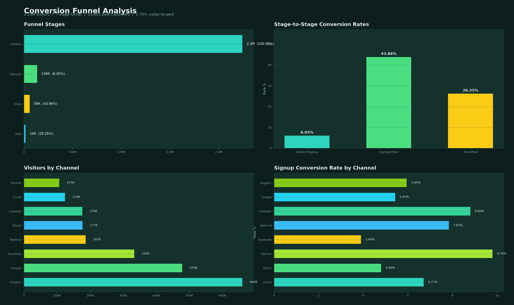
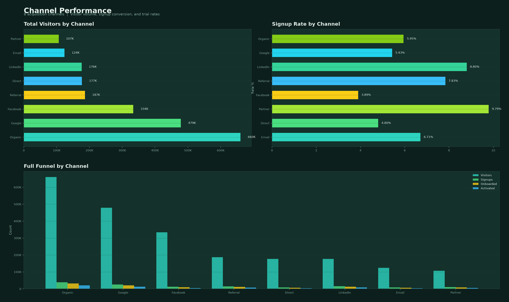
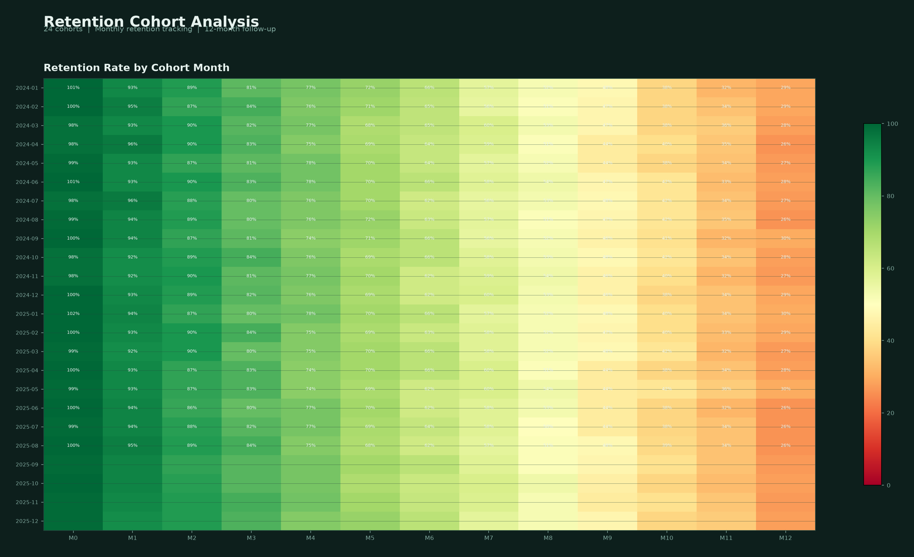
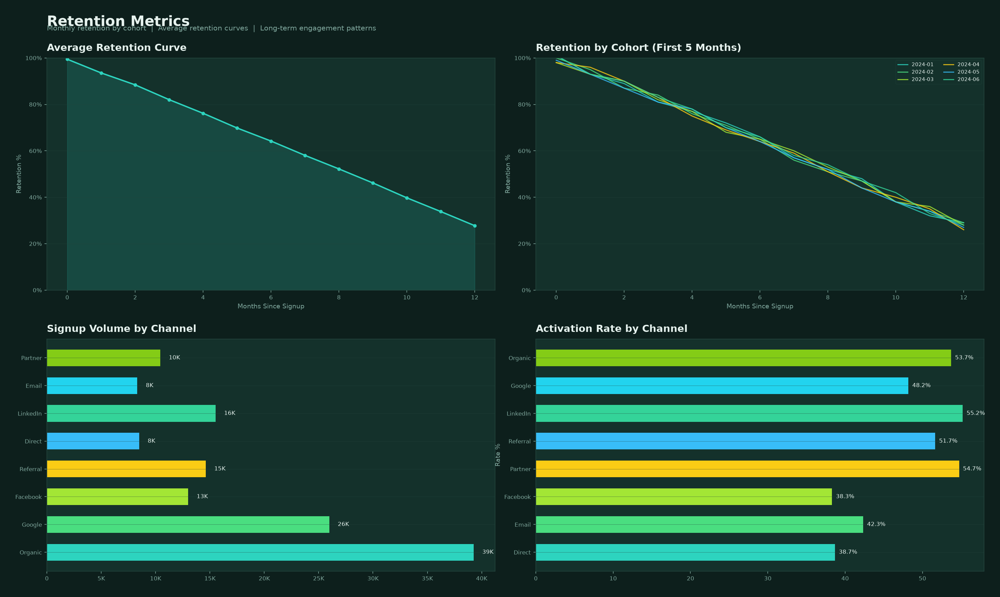
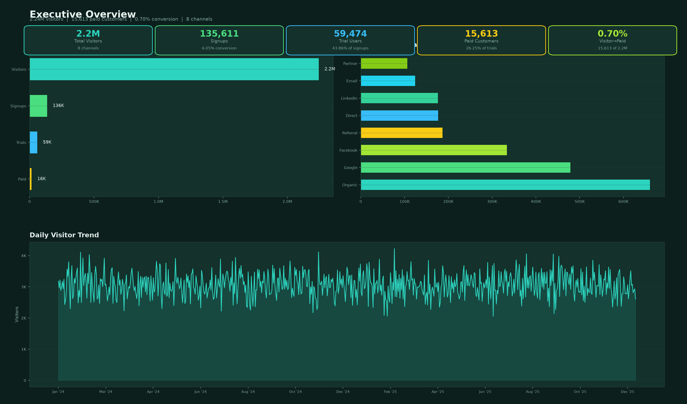

# E-Commerce Conversion Funnel Analysis

[](https://github.com/kavyanjali-karan/growth-funnel-performance-review/actions/workflows/ci.yml) [](tests/) [](LICENSE)

An end-to-end analytics pipeline that transforms 2.24M **simulated** visitor records into a 7-stage conversion funnel, uncovering a 0.70% visitor-to-paid conversion rate across signups, trials, and paid adoption.

**Live dashboard:** [interactive dashboard](https://kavyanjali-karan.github.io/growth-funnel-performance-review/dashboard.html) — rebuilt in CI from the committed data.

## Where the funnel leaked

Marketing was spending across multiple channels but had no unified view of where visitors dropped off between acquisition and payment. Signup-to-trial conversion varied wildly by channel, and the product team had no data on which onboarding steps correlated with paid conversion. The business was leaving revenue on the table without knowing which funnel stage to optimize.

## Pipeline overview

1. **Data Generation** — Created a realistic dataset of 2.24M visitor records across 8 channels with granular session-level data (device, country, session duration) and daily-channel aggregations
2. **7-Stage Funnel Pipeline** — SQL and Python pipeline that tracks visitors through: Acquisition → Signup → Onboarding → Profile Completion → Feature Activation → Trial → Paid Conversion
3. **Star-Schema Power BI Dashboard** — DAX measures tracking signup (6.05%), trial (43.86%), and paid conversion (26.25%) stages with channel and device breakdowns
4. **Metric Governance** — Documented metric definitions, SOPs, and optimization recommendations for each funnel stage

## Key Findings

| Stage | Conversion Rate | Volume |
|-------|----------------|--------|
| Visitor → Signup | 6.05% | 135,611 signups from 2.24M visitors |
| Signup → Trial | 43.86% | 59,474 trials from 135,611 signups |
| Trial → Paid | 26.25% | 15,613 paid from 59,474 trials |
| **Visitor → Paid** | **0.70%** | **15,613 paid customers** |

The biggest drop-off is at the Visitor → Signup stage (93.95% attrition), suggesting acquisition targeting and landing page optimization are the highest-leverage improvement areas.

## Data

The dataset simulates an e-commerce platform with multi-channel visitor acquisition:

| Dataset | Records | Description |
|---------|---------|-------------|
| `visitors.csv` | 5,848 | Daily × channel aggregations (sum = 2,243,206 visitors) |
| `visitors_granular.csv` | 2,243,206 | Individual visitor records with device, country, session duration |
| `signups.csv` | 5,848 | Daily signups by channel |
| `trials.csv` | 5,848 | Daily trial initiations by channel |
| `paid_customers.csv` | 5,848 | Daily paid conversions by channel |
| `onboarded.csv` | 5,848 | Daily onboarding completions |
| `profile_completed.csv` | 5,848 | Daily profile completions |
| `activated_feature.csv` | 5,848 | Daily feature activations |
| `marketing_spend.csv` | 5,848 | Daily marketing spend by channel |

Regenerate with:
```bash
pip install pandas numpy
python data/generate_data.py           # aggregated CSVs
python data/generate_granular_visitors.py  # 2.24M-row granular file
```

## Dashboards

Scripts in this repo render every image below from the pipeline output — nothing is hand-drawn. The stills come from
[`python/generate_dashboard_pngs.py`](python/generate_dashboard_pngs.py) and the interactive page from
[`python/generate_dashboards.py`](python/generate_dashboards.py), using the same Power BI design system.

### Funnel Analysis


### Channel Performance


### Cohort Analysis


### Retention Metrics


### Executive Overview


### Regenerating the dashboards

```bash
python data/generate_data.py              # datasets (seeded, reproducible)
python python/generate_dashboard_pngs.py  # renders assets/*.png
python python/generate_dashboards.py      # builds assets/dashboard.html (Chart.js inlined, no CDN)
```

Every push rebuilds both dashboards from the committed data before Pages publishes, so the
live dashboard and the images in this README always agree.

## Project Structure

```
├── data/
│   ├── raw/              # Generated CSVs (visitors, signups, trials, etc.)
│   ├── curated/          # Aggregated metrics by channel, cohort
│   └── warehouse/        # Target calendars, growth goals
├── sql/
│   ├── ddl/              # Table definitions
│   ├── staging/          # Staging views
│   ├── marts/            # Business marts
│   ├── metrics/          # Metric calculations
│   ├── monitoring/       # Data quality checks
│   └── reporting/        # Dashboard queries
├── python/
│   ├── extraction/       # Data loading
│   ├── transformation/   # Cleaning and enrichment
│   ├── validation/       # Quality checks
│   ├── monitoring/       # Pipeline health
│   ├── reporting/        # Business report scripts
│   ├── generate_dashboard_pngs.py   # Renders the dashboard PNGs in assets/
│   └── generate_dashboards.py       # Builds the interactive assets/dashboard.html
├── powerbi/
│   ├── dax/              # DAX measures (acquisition, conversion, retention, revenue, time intelligence)
│   └── model/            # Semantic model docs
├── docs/                 # Architecture, glossary, metric dictionary, business reviews, scorecards
├── outputs/              # Generated reports
├── tests/                # Data quality tests (pytest)
└── assets/               # Dashboard screenshots
```

## Running Tests

```bash
pip install pytest pandas numpy
pytest
```

18 tests covering data quality, funnel-stage math, and dashboard inputs. Fresh clones need no setup — the datasets regenerate on the first run of the suite.

## Tech Stack

SQL, Python (pandas, numpy), Power BI, DAX, Power Query, pytest, GitHub Actions, Git
