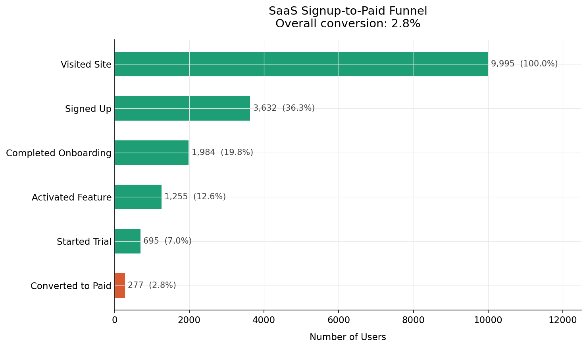
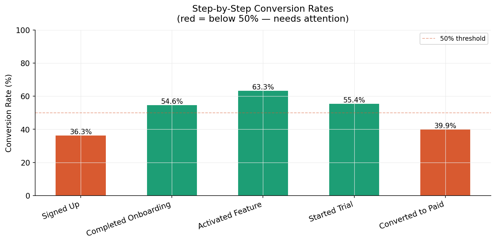
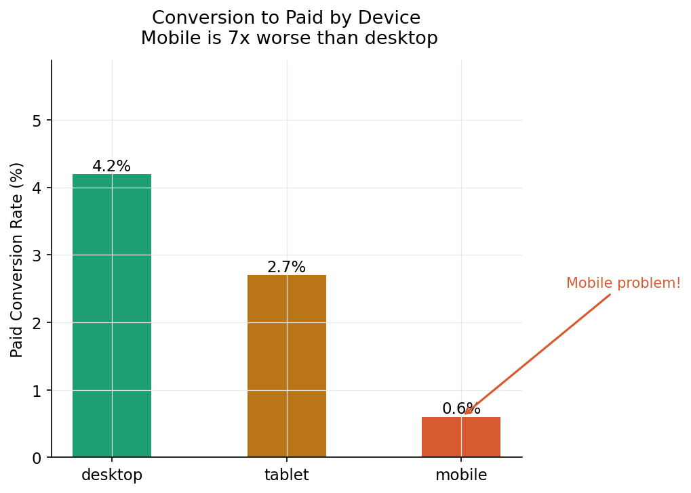
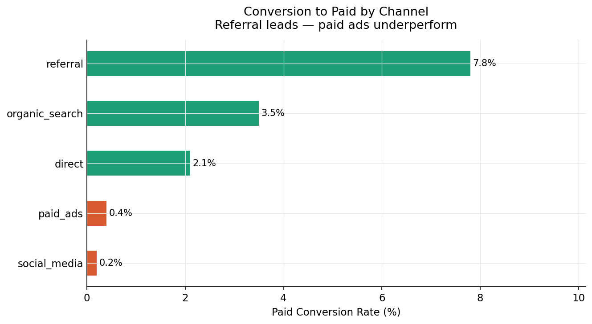
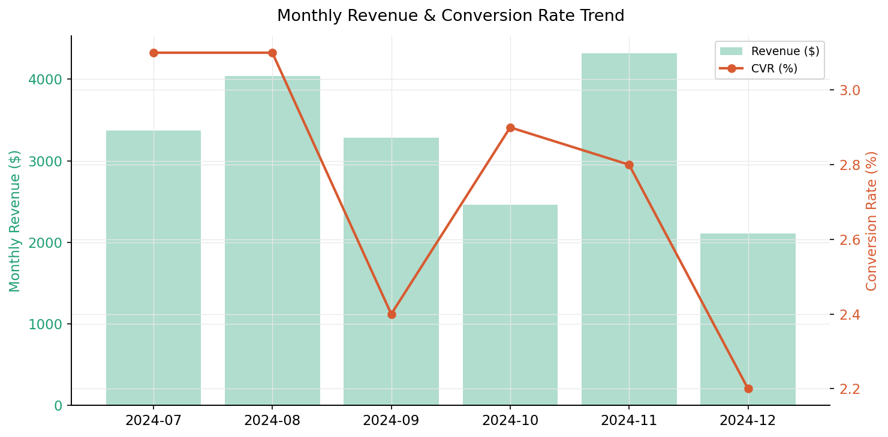
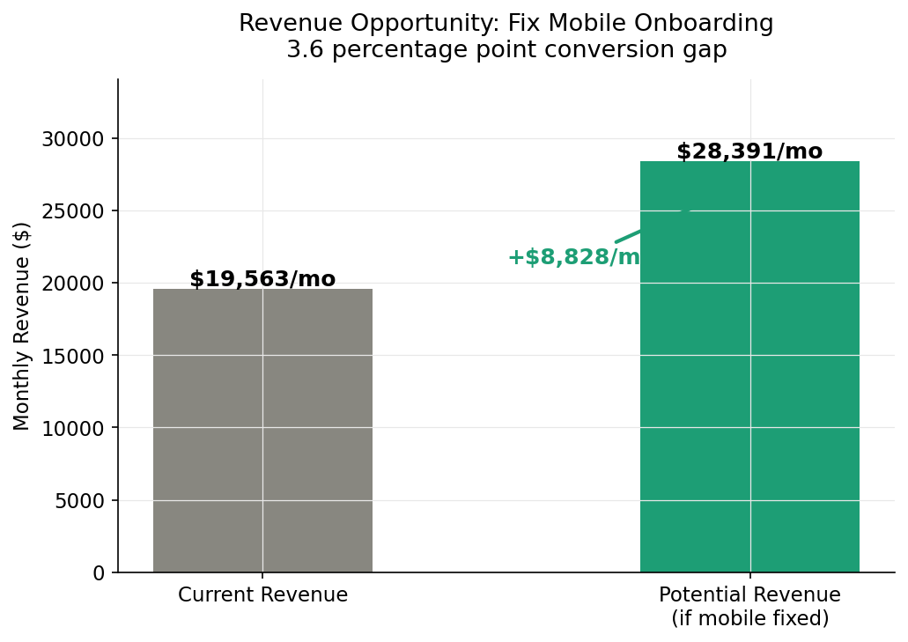

# SaaS Conversion Funnel Intelligence

**$8,828/month in recoverable revenue identified** by isolating a mobile UX gap (0.6% vs 4.2% desktop conversion) — with ranked, quantified recommendations for a product team to act on immediately.

Built by [Kavyanjali Karan](https://linkedin.com/in/kavyanjali-karan) · March–April 2026

---

## The Business Problem

A SaaS product team had visibility into total revenue but no structured view of *where* users were dropping off the acquisition funnel or *what it was costing them*. Without stage-level data, every fix attempt was a guess.

This analysis answers: which stage is losing the most revenue, which user segment has the worst conversion, and what is the ranked list of actions to take?

---

## Key Results

| Metric | Value |
|---|---|
| Total users analysed | 9,995 |
| Overall funnel conversion | 2.8% (Visit → Paid) |
| Monthly revenue | $19,563 |
| Revenue opportunity (mobile fix) | **$8,828/month** |
| Referral vs social media conversion | 7.8% vs 0.2% — 39× gap |

---

## Funnel Overview

| Stage | Users | Step Conversion | Overall |
|---|---|---|---|
| Visited Site | 9,995 | 100.0% | 100.0% |
| Signed Up | 3,632 | 36.3% | 36.3% |
| Completed Onboarding | 1,984 | 54.6% | 19.8% |
| Activated Feature | 1,255 | 63.3% | 12.6% |
| Started Trial | 695 | 55.4% | 7.0% |
| Converted to Paid | 277 | 39.9% | 2.8% |

---

## Charts

### Funnel overview


### Step-by-step conversion rates


### Mobile vs desktop conversion gap


### Channel conversion — Referral vs Social


### Monthly trend


### Revenue opportunity quantification


---

## Findings & Recommendations (Ranked by Revenue Impact)

### 1. Mobile onboarding is broken — $8,828/month opportunity

Mobile users convert to paid at 0.6% vs 4.2% on desktop. The onboarding step is the bottleneck — multi-step wizard flows on small screens have documented high abandonment.

**Action:** Rebuild mobile onboarding as a single-action-per-screen progressive flow with progress indicators. This is the highest-ROI fix in the funnel.

### 2. Top-of-funnel leak — Visit → Signup at 36.3%

Only 1 in 3 visitors creates an account. This is a value-proposition and friction problem at the landing page level.

**Action:** A/B test homepage headline and reduce the signup form from 5 fields to 2 (email + password). Estimated 5–8% lift in signup rate based on industry benchmarks.

### 3. Referral channel is 39× better than social — budget is misallocated

Referral converts at 7.8% paid; social media at 0.2%. Budget is split roughly evenly between channels.

**Action:** Redirect 30% of social spend into a referral incentive programme (e.g. 1 free month per paying referral). ROI is order-of-magnitude better.

---

## Project Structure

```
saas-funnel-analysis/
├── data/
│   ├── raw_funnel_data.csv         ← 9,995 users, simulated
│   ├── clean_funnel_data.csv
│   ├── device_funnel.csv           ← Segmented by device
│   ├── channel_funnel.csv          ← Segmented by acquisition channel
│   └── revenue_opportunity.csv     ← Quantified business impact
├── notebooks/
│   ├── phase2_generate_data.py
│   ├── phase3_clean_data.py
│   ├── phase4_analyze.py
│   ├── phase5_visualize.py
│   └── phase6_package.py
├── charts/                         ← 6 exported chart images
└── README.md
```

---

## Tech Stack

`Python` · `Pandas` · `NumPy` · `Matplotlib` · `Seaborn` · `Plotly`

---

## Run Locally

```bash
git clone https://github.com/karankavyanjali77-sys/saas-funnel-analysis
cd saas-funnel-analysis
pip install pandas numpy matplotlib seaborn plotly

python notebooks/phase2_generate_data.py
python notebooks/phase3_clean_data.py
python notebooks/phase4_analyze.py
python notebooks/phase5_visualize.py
```

---

**Kavyanjali Karan** · B.Tech CSE, ITER SOA University (2027)  
[LinkedIn](https://linkedin.com/in/kavyanjali-karan) · [GitHub](https://github.com/karankavyanjali77-sys)
